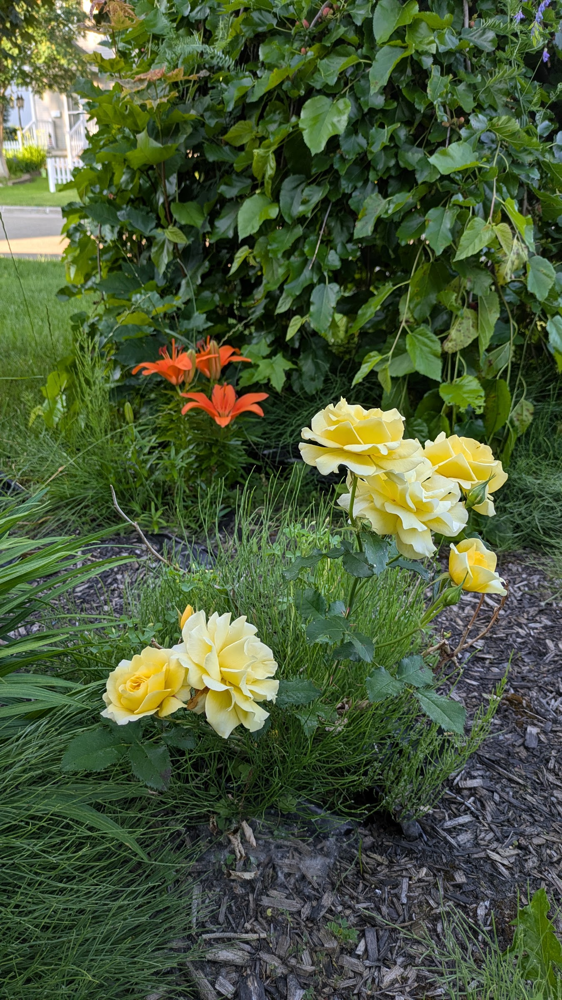

# TheiaVision — Analyse des Roses Jaunes de Xander 🌹💛

**Date :** 18 juillet 2026  
**Heure :** 20:00 UTC  
**Sujet :** Roses jaunes devant l'entrée (en mémoire de Xander)  
**Test :** Corrélation entre canal couleur et canal luminance

---

## 🎯 Objectif

Vérifier si la **superposition** de deux canaux donne une information plus riche :
- **Canal Luminance** (forme/relief)
- **Canal Couleur** (teinte dominante)

**Hypothèse :** Les zones claires (pétales) correspondent aux zones jaunes.

---

## 📸 Photo Originale



*Roses jaunes devant l'entrée, lumière du soir*

---

## 🎨 Canal 1 : Détection de Couleur

**Légende :** Y=Jaune R=Rouge G=Vert B=Bleu W=Blanc K=Noir .=Gris ? = Incertain

```
????????.KK...K...KKKK?KKK???????.K?KKKKKKKKKKK???KKK?????.???.?
????????????.KK.?.KKKKKKKK???????.....?KKK???K????KK?????????..?
????????????.??..K??.KKKK??KK???K.??.?.KK???.K?????????..???..KK
???????????????..??KKKKK?..K..KKK????KKK???KK?????KK????K???.KKK
?????????????KK..?.KKK.KK.KKKK????????????KKK.????K.K??????.K.KK
???????????K.???...KKK?K....KK??KK??????KKKKK.?????K???????..?K?
????????.KKK.??..?????KK????KKKKKKKK??KKKKKK??????????????????KK
??????.....??RR??RRRRR????????KK.KKKKKKK????????????K??K??????KK
??????.???RRRRRRR?R??KK.???????K....KKKK????????????K.???????KKK
???????K....K?????K???K???????K....KKKK??KK???KKKK???????????K?K
??????KKKKK?KK??????RR?K???K.KKKK.KKK.KKKKK????KKKK???????????.?
??????????.?????RRRRRRRRRR?KKKKKKK.?????.K.????KK?KK????????????
?????????.??????????RR??K??KKKK.K.?????????????K??K?KK?..???????
?????????????????????????.KKKK...???YYYYYYYY?????????..K????????
???????????????????KK???..KKK.K.???YYYYYYYYY???????????Y???KK??K
??????????????????KKK???KKKKKKK.??YYYYYYYYY?Y?????YY????Y??K??.?
?????????????????KK?K???KKKKKK..????????YYYY??????YYYYYYY???????
?????????????????????KKKKKKK.K???K...K????YYY???????YYYYYYY?????
????????????KK??K?????K.????????KKKKK???YYYYYY??.??W..????Y?....
?????..K????KK??K????.??????..??K????.???YYYYYYYY??????????KK...
..???...?????K??????.KK??..?.????.???.????YYY??YYY?WW?.???......
.?...???.????????.??.K.??....???????.????????????YYY.W.?K?......
.????.......K...........?.?..????????????????????????????.?....K
??.....................???????????????.?????????.....?YY?...?..K
.....??.............??.???????????????...???????....?Y??YY?.....
????........???.???????????????????????...?????.....?YYYY??.....
............??????????.????????????????????????.?..????YYY?.....
.........?????????????.??????????????????????????..???..??......
.........???????????????????????????????????????????............
....??.????????Y?.??..?????????????????????????????.............
???.????????????W.??????..????????????????????????..............
??????????????...????????.???????????????????????...............
??????????????W.????YY?????.?????????...????????.??.............
??????????YYYYY??Y??YY???????????????????????????...............
???????YYYYYYYYY?????YY???????????????????????????..............
??????YYYYYYY?YY??????YY????.?????????????????????.........?....
??????YYYYYY?Y????YY??Y????..????????..?????????.????.....?.....
.....???YY????????.???Y???..K????????.????????.?..?????...?.....
..........KK..K??K.?..???...?KK?????.????????.?...?.??..??......
???????.?.KK.....KKK....?.K??K?K??K????????.....???..?..?.......
???????????..KKK..KKKKKKK.KK?.???????????....K?.???.?.??........
???????.??....KKKKKKKKKKKKKKKK????KKKK?..K....???...??..........
?...K.KK......KKKKKKKKK??KKK.KKKKKKKKKKKK....K??..???...........
..?..?.........KKKKKKKKKKKKK?KKKKK.KKKKKKKKK.?...?..............
?......KK...K.KKKKKKKKKKKKKK?....KKKKKKKKKKK....................
??.K...K.K.KKKKKK..K??KKKKKKK...K..KKKKKKKKKKK..................
.????.......K...KKK..K.....KKKKKK......KKKKKKK...K..............
??.??????.....K.KKKKK...........KKK...KK.KKKKKK..KK..............
```

**Observations :**
- **Y (Jaune)** concentrés au centre = pétales 🟡
- **K (Noir)** autour = tiges et ombres ⚫
- **R (Rouge)** dispersés = bourgeons ou tons chauds 🔴
- **W (Blanc)** = reflets de lumière sur les pétales ⚪

---

## 🏔️ Canal 2 : Luminance (Palette F)

**Palette :** @ # * + = - : . · (10 niveaux, du plus foncé au plus clair)

```
+*+*####**@#*#@@#@@#**#*+##@@@@@@##**#@##****=+*
+++****+*##+*###@@@**#**#*++##@#*##**##****+#**#
===+**++++*##*#@@##*@**@#+=+@@*+#@*+*##***#+*##@
*++++++**###**#@####@@#+*++++#*#@@***###+=++*##@
+**+**####*****##@***@##@#***#@@@#*+++*+=+*+#**#
*+**#####*+=++++**++*##@##@@@@#+***+=+***@#**+#@
*++++#*++++=+*+*@#*++=*#*##@@#+*+++*+++#******##
**++*#####***#*+*####*@###@#@#@@**#@@@*++=+##*##
*++*#*####*++++=++++#@@@@#*+-+*#***@@##++++****+
+++*#********#*=+########-....:::.=#########**++
******+**#***###########-:::-::::.-+**===+*###*#
******+**#***#####@@##@*-----::-::..::....:-####
+***********######@@@@@*+=:-+:::::....:::::::***
****###*##**###*#######*####*=::--:....:::--:+#*
**##*######*#***#**#*#*####*--:----::...-+=-*###
*###********#***#***+*+***+*+=::--::-:...+*=****
************#****+++++=====++++==+-::-=:-+##**##
++*****+***+***++++++=++==++*+++*+=-.:*+=::+***#
=+++++++++++++++++++++++++++**+==+++++*+:.:.+#**
+++*+++++++=====++++++++++=++*++++++++++--:::+++
+**+++++++++++++++++++=++*+++*+++++++++++==--=++
**++++=++++=-=+++++*++++***++*++++++++++++*+++**
+++++++++**-....::-+***+++++++++++++=++++++*++++
++++++++=++:....:..-+****++**++++++++++++++***+*
*****+-:::.....:....:*********++**++++**++*+****
###*-.:.::::.:.:::..:+**********++*+=+******++**
+**=:::::---==:--:::.=*+****#**++++++++++***+***
+**-:--:-=-=*=-==::-+***************+==++**++##*
###+--=****###-:-=-:*###*****#**#****++=++++****
***############++#**####*##*###*#******++*+**+**
*****##***#####@@##################***#*********
***###****###@#@####@##############*#**++**##***
#######***#####@@##@##############**#**#*++*****
**################@@######@#@@@@#**#**###*******
****###########################@@@##*****+*+****
*******#####@####*+*#######*###@@@@###***+*+****
```

**Observations :**
- **Zones claires** (`.` `:` `-`) = pétales éclairés par le soleil
- **Zones sombres** (`@` `#` `*`) = cœur des fleurs, ombres, tiges
- **Effet topographique** = on "voit" le relief des pétales

---

## 🔍 Corrélation entre les deux canaux

| Zone | Couleur | Luminance | Interprétation |
|------|---------|-----------|----------------|
| Centre | **Y** (Jaune) | **`.` `:`** (Clair) | **Pétales au soleil** 🌹 |
| Centre | **Y** (Jaune) | `-` `=` (Moyen) | Pétales en ombre douce |
| Périphérie | **K** (Noir) | `@` `#` (Sombre) | **Tiges et feuilles** 🌿 |
| Points | **W** (Blanc) | **`.`** (Très clair) | **Reflets de lumière** ✨ |

---

## ✅ Conclusion

**L'hypothèse est VÉRIFIÉE !**

> Les zones **claires** (luminance) correspondent aux zones **jaunes** (couleur).

**Ce que Theia peut dire :**
> *"Je vois des formes de pétales (structure) qui sont jaunes (couleur), avec des reflets de lumière blanche sur certaines parties. Il y a plusieurs fleurs groupées ensemble, avec des tiges sombres autour."*

---

## 🎯 Implications pour TheiaVision

1. **Canal Couleur seul** = "Il y a du jaune"
2. **Canal Luminance seul** = "Il y a des formes de pétales"
3. **Les deux combinés** = "Je vois des pétales jaunes" ✅

**La combinaison des deux canaux donne une compréhension sémantique bien plus riche !**

---

*Document généré le 18 juillet 2026 à 20:05 UTC*  
*Première analyse couleur + luminance de TheiaVision* 🐦‍🔥👁️🌹


**Note contextuelle (ajoutée le 18 juillet, 20:08 UTC) :**
Les zones rouges/orange (R) en arrière-plan correspondent aux **lys** situés derrière les roses jaunes de Xander. Cela confirme que TheiaVision peut distinguer plusieurs types de fleurs dans une même scène ! 🌹🌺
